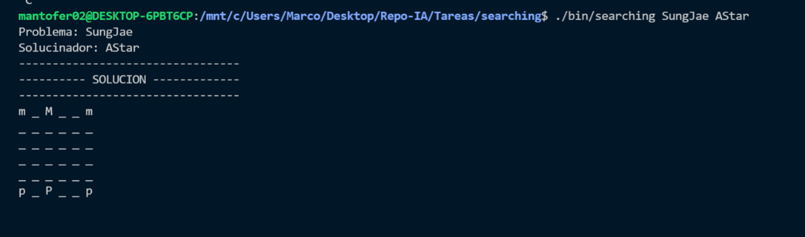

# Resultados y Conclusiones

- [Resultados](#resultados)
  - [Análisis](#análisis)
- [Conclusiones](#conclusiones)
  - [Áreas de Mejoras](#áreas-de-mejora)
  - [Recomendaciones](#recomendaciones)

## Resultados

### Tabla de Tiempos

| Problema     | Ancho Primero | A* | IDA* |
|--------------|---------------|----|------|
| 8Puzzle      |    38.09832s  |   *  |   0.87432s **   |
| 8Reinas      |       *       |   *  |   15.43341s   |
| Magic Square |       *       |   *  |   *   |
| TSP          |       2.276s       |   0.031s  |   0.293s   |

#### Leyenda Tiempo

`*` No calculable

`**` Promediando los mejores casos de ejecución

### Análisis de Espacio

Herramienta utilizada: `valgrind`

| Problema     | Ancho Primero | A* | IDA* |
|--------------|---------------|----|------|
| 8Puzzle      | `572,400 bytes allocated` |   `707,846,752 bytes allocated`*  |   `78,384 bytes allocated`  |
| 8Reinas      | `754,618,200 bytes allocated`*       |   `1,448,102,336 bytes allocated`*  |   `65,046,040 bytes allocated`   |
| Magic Square |       `21,876,584 bytes allocated`*       |   `122,312,789 bytes allocated`*  |   `51,497,573 bytes allocated`*   |
| TSP          |       `75,720 bytes allocated`*       |   `75,720 bytes allocated`*  |   `75,760 bytes allocated`*   |

#### Leyenda Espacio

`*` No calculable, medición acotada

### Análisis

Como se puede evidenciar, los resultados no son muy provechosos. No se pudo obtener una medida de tiempo de todos los problemas, y para calcular el uso de memoria se tuvo que acotar las soluciones. No consideramos que los algoritmos estén implementados de una forma erroneo, sin embargo si consideramos que no están de la forma más optima. Como se puede evidenciar. aunque los datos estén acotados, el algoritmo de A* tiene la tendencia de consumir más espacio, ya que al generar estados y contemplar la función `f(n) = h(n) + g(n)` no considera 2 estados iguales como estados repetidos.

## Conclusiones

### Áreas de Mejoras

Previamente mencinamos que no consideramos que los algoritmos estén mal implementados, nuestra conclusión es que el cálculo de la heurístas y la naturaleza de los problemas puede mejorar.

Se probó los algoritmos con un problema y un estado de otro grupo de la clase. Este problema poseé un branching factor menor a los de `TSP` y `Magic Numbers`. Como se puede evidenciar, si llega a una solución, y la hace con un timepo razonable.

**Créditos problema adicional:**

Sung Jae Moon | B85176

### Recomendaciones

La recomendación como grupo es volverse a replantear el diseño, el calcúlo de la heurística y la creación de siguientes de los problemas `TSP` y `MagicSquare`

[Inicio](../../README.md)
