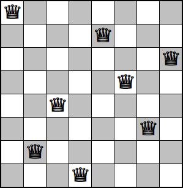

# Problema 8Reinas

## Tabla de contenidos

- [Descripción del Problema](#descripción-del-problema)
- [Implementación del Problema](#implementación-del-problema)
  - [Heurística](#heurística)

## Descripción de Problema

El problema de 8Reinas consiste en colocar en un tablero de ajedrez 8 Reinas, valga la redundancia, en tal posición que cada reina no esté en una posición donde se pueda comer a otra en el siguiente turno.

Una posible solución es como la que se encuentra en la imagen.

## Implementación del Problema

Para implementar este problema, se genera un estado inicial en dónde se ponen 8 reinas en un tablera de ajedrez de forma aleatoria. Cada estado siguiente es un estado nuevo dónde se mueve una reina a todos sus posibilidades.

### Heurística

Para el cálculo de la heurísta se hace un método que maneja 

[Inicio](../../README.md)
