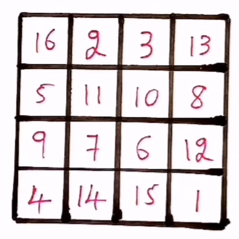

# Problema Magic Square

## Tabla de contenidos

- [Descripción del Problema](#descripción-del-problema)
- [Implementación del Problema](#implementación-del-problema)
  - [Heurística](#heurística)

## Descripción de Problema

El problema de *Magic Square* o cuadrado mágico consiste en tener una matriz `n x n` en dónde el resultado de sumar cada fila, el resultado de suma cada columna y el resultado de sumar cada diagonal es el mismo.

## Implementación del Problema

Para las pruebas se implementó una matriz que simula el tablero. Esta matriz puede utilizar un set de números previamente definidos.

El estado inicial va a ser el tablero vacio, y el siguiente estado es un estado generado a partir de agregar un número es una posición que se encuetre vacia.

### Heurística

Para el cálculo de la eurística genera la sumatoria de los números faltantes para tener el resultado deseado. Por implementación, se desea que si en una columa o fila la sumatoria de valores es mayor a el resultado deseado se va a **castigar**, ya que es un estado que no nos funciona. Por lo tanto, se le suma un valor de castigo definido arbitrariamente.

[Inicio](../../README.md)